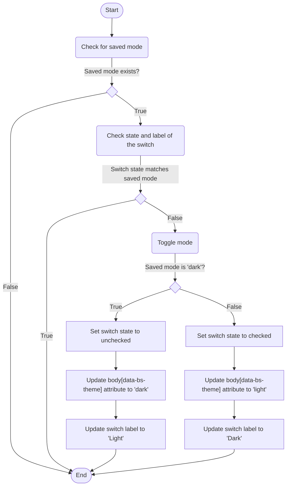

# Flow

```mermaid
graph TD;
    A([Start])
    A --> B(Check for saved mode);
    B --> |Saved mode exists?| C{ }
    C -->|True| D(Check state and label of the switch);
    C -->|False| R([End]);
    D -->|Switch state matches saved mode| I{ }
    I --> |True| R;
    I -->|False| F(Toggle mode);
    
    F -->|Saved mode is 'dark'?| H{ };
    H -->|True| K[Set switch state to unchecked];
    H -->|False| L[Set switch state to checked];


    K --> N["Update body[data-bs-theme] attribute to 'dark'"];
    L --> O["Update body[data-bs-theme] attribute to 'light'"];

    N --> P[Update switch label to 'Light'];
    O --> Q[Update switch label to 'Dark'];
    P --> R;
    Q --> R;
```
